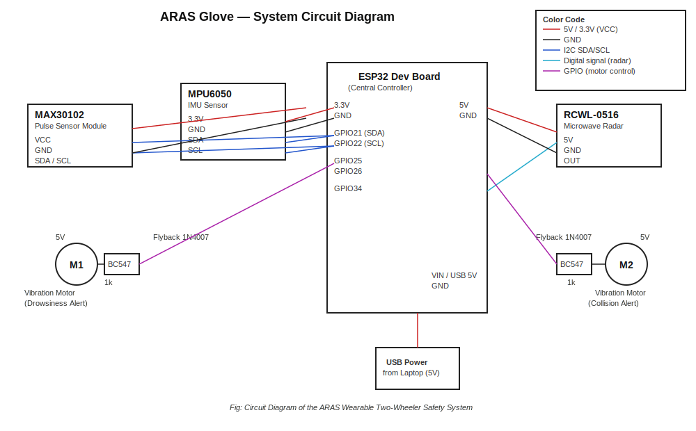
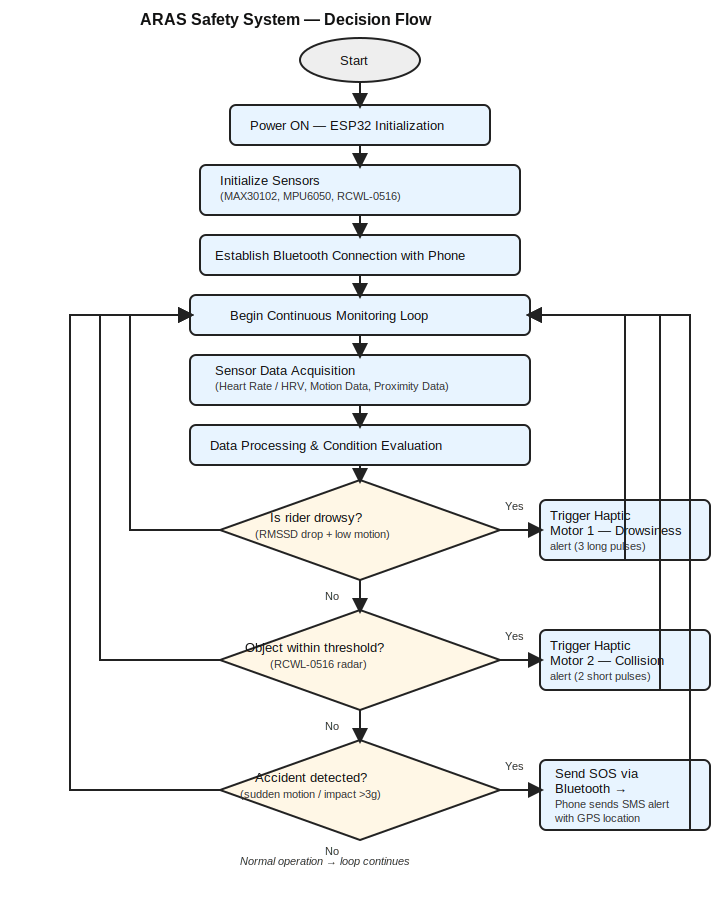

# 🛡️ ARAS — Wearable IoT-Based Two-Wheeler Safety System

> A glove-mounted embedded safety device for motorcycle/two-wheeler riders that fuses heart-rate-variability–based drowsiness detection, bidirectional radar collision sensing, and IMU-based accident detection — with automatic Bluetooth-to-SMS emergency SOS alerts and dual-channel haptic feedback.


---

## 📖 Table of Contents

- [Overview](#-overview)
- [Why This Exists](#-why-this-exists)
- [System Architecture](#-system-architecture)
- [Key Features](#-key-features)
- [Hardware](#-hardware)
- [How the Safety Algorithms Work](#-how-the-safety-algorithms-work)
- [Repository Structure](#-repository-structure)
- [Getting Started](#-getting-started)
- [Circuit Diagram](#-circuit-diagram)
- [System Flow](#-system-flow)
- [Experimental Results](#-experimental-results)
- [Novelty vs. Prior Art](#-novelty-vs-prior-art)
- [Applications](#-applications)
- [Roadmap](#-roadmap)
- [Tech Stack](#-tech-stack)
- [License](#-license)

---

## 🔍 Overview

**ARAS** (the on-device Bluetooth codename used in firmware, short for the project's internal identifier) is a wearable, glove-based safety system for two-wheeler riders. It combines physiological monitoring, motion-based accident detection, and radar-based collision sensing into a single low-cost embedded platform — something most existing rider-safety research treats as separate, siloed systems (helmet-only accident detection, vision-only collision warning, or standalone health monitors).

The system is built around an **ESP32** microcontroller and three sensors — a **MAX30102** pulse oximeter, an **MPU-6050** IMU, and an **RCWL-0516** microwave radar module — plus two coin vibration motors for distinct, non-visual haptic alerts. When the onboard firmware detects a likely accident, it transmits an SOS message over Bluetooth Classic (SPP) to a paired **Android companion app**, which fetches the rider's GPS location and automatically sends an emergency SMS to a pre-configured contact.

This repository contains **both halves of the working system**:
1. `firmware/` — the ESP32 embedded firmware (sensor fusion, HRV analysis, alert logic, BT SOS transmission)
2. `android-app/` — the Android (Kotlin) companion app that listens for the BT SOS signal and sends the emergency SMS with a live GPS link

---

## 🎯 Why This Exists

Two-wheeler riders are among the most vulnerable road users, yet most Advanced Driver Assistance System (ADAS) research and tooling targets four-wheelers. Existing two-wheeler safety work tends to address only one dimension at a time:

- Helmet-based accident detection *or*
- Vision/radar-based frontal collision warning *or*
- Standalone wearable heart-rate monitoring

ARAS integrates all three into a single **glove-worn** device — chosen over a helmet or vehicle mount because a glove gives direct skin contact for accurate pulse sensing, delivers haptic feedback right at the rider's hand, and is comfortable enough for everyday wear.

---

## 🧩 System Architecture

```
┌─────────────────────────── WEARABLE GLOVE (ESP32) ───────────────────────────┐
│                                                                                │
│   MAX30102  ──IR signal──▶  Peak detection ──▶ IBI ──▶ RMSSD (HRV)           │
│  (fingertip)                                             │                    │
│                                                            ▼                   │
│   MPU-6050  ──accel/gyro──▶ Motion magnitude ──▶ Accident / low-motion flags  │
│  (motion)                                                 │                    │
│                                                            ▼                   │
│   RCWL-0516 ──radar pulse──▶ Object-proximity flag                            │
│  (collision)                                              │                    │
│                                                            ▼                   │
│                              Priority-based Alert Engine                       │
│                    (Accident > Drowsiness > Object Detected)                   │
│                          │                        │                            │
│                          ▼                        ▼                            │
│                Dual Haptic Motors          Bluetooth SPP "SOS:REASON"          │
└─────────────────────────────────────────────────│────────────────────────────┘
                                                    │  Bluetooth Classic (SPP)
                                                    ▼
┌───────────────────────── ANDROID COMPANION APP (Kotlin) ─────────────────────┐
│  Listens on paired ESP32 socket → detects "SOS" → fetches GPS fix via         │
│  FusedLocationProvider → sends emergency SMS with Google Maps link            │
└────────────────────────────────────────────────────────────────────────────────┘
```

---

## ✨ Key Features

- **Sensor-fused drowsiness detection** — Heart Rate Variability (RMSSD) computed from real-time PPG peak intervals, combined with a low-motion check, to flag fatigue rather than relying on raw heart rate alone.
- **Bidirectional-ready collision sensing** — RCWL-0516 microwave radar detects nearby moving objects with a debounced cooldown to avoid alert spam.
- **Accident detection** — MPU-6050 acceleration-magnitude thresholding flags sudden impacts/falls in real time.
- **Priority-based alert arbitration** — Accident alerts always pre-empt drowsiness and proximity alerts; each alert type has a distinct vibration pattern so the rider can distinguish them without looking down.
- **Bluetooth SOS bridge** — On accident detection, the ESP32 pushes an `SOS:ACCIDENT|TIME:<ms>` message over Bluetooth Serial (SPP) to a paired phone.
- **Automatic emergency SMS** — The Android app listens continuously, grabs a high-accuracy GPS fix (with a `lastLocation` fallback), and sends a Google-Maps-linked SMS to a preconfigured emergency contact — including dual-SIM handling.
- **Production-shaped Android app** — Runtime permission handling for BT/location/SMS (including Android 12+ `BLUETOOTH_CONNECT`/`BLUETOOTH_SCAN`), a foreground-service scaffold (`SOSForegroundService.kt`) for background reliability, and a live connection/log UI.

---

## 🔩 Hardware

| Component | Role |
|---|---|
| **ESP32 Dev Board** | Central controller — sensor fusion, alert logic, Bluetooth SPP |
| **MAX30102** (Pulse Oximeter / HR Sensor, HW-605 breakout) | PPG signal for heart-rate-variability–based drowsiness detection |
| **MPU-6050** (6-axis IMU) | Motion/acceleration data for accident and low-motion detection |
| **RCWL-0516** (microwave radar motion sensor) | Proximity/collision detection |
| **2× Coin vibration motors** (driven via BC547 + flyback diode) | Distinct haptic feedback per alert type |
| **Wearable glove** | Mechanical housing/mounting for all of the above |

See [`hardware/bill-of-materials.csv`](bill-of-materials.csv) for the full parts list, and [`firmware/README.md`](README2.md) for the exact pin mapping.

> 💡 Powered via USB (5V regulated) from a laptop for this prototype stage — battery/regulator integration is on the [roadmap](#-roadmap).
For full hardware setup,view [`README1.md`](Glove_hardware.jpg)
---

## 🧠 How the Safety Algorithms Work

### 1. Heart-Rate-Variability (HRV) Drowsiness Detection
Rather than triggering on absolute heart rate (which varies a lot rider-to-rider), the firmware:
1. Detects PPG peaks from the smoothed MAX30102 IR signal.
2. Computes **Inter-Beat Intervals (IBI)** between peaks, with artifact rejection (rejects physiologically implausible IBIs and beats that deviate >35% from the previous interval).
3. Computes **RMSSD** (root mean square of successive IBI differences) — a standard short-term HRV metric — over a rolling 20-beat window.
4. Builds a **personal RMSSD baseline** from the first 15 stable readings.
5. Flags drowsiness when RMSSD **drops more than 30%** below that baseline *and* the rider's hand shows abnormally low motion — combining two independent signals to reduce false positives.

### 2. Accident Detection
The MPU-6050's 3-axis acceleration magnitude is continuously compared against a 1g baseline; a spike above a fixed threshold (`> 3g`) is treated as a probable fall/impact and immediately triggers the highest-priority alert — checked independently on every loop iteration, not just during heartbeat samples.

### 3. Collision / Proximity Detection
The RCWL-0516 radar module outputs a digital HIGH when it detects a moving object nearby. A 2-second cooldown debounces repeated triggers into a single alert event.

### 4. Priority-Based Alert Arbitration
```
Priority:  ACCIDENT (3)  >  DROWSINESS (2)  >  OBJECT_DETECTED (1)  >  NONE (0)
```
A new alert only overrides the current one if it's higher priority, or if the current alert's display duration has expired — preventing rapid flicker between simultaneous conditions while still guaranteeing an accident alert is never suppressed.

### 5. Bluetooth SOS Bridge
Only `ACCIDENT`-level alerts push a message over Bluetooth SPP (`SOS:ACCIDENT|TIME:<millis>`); the Android app treats any inbound chunk containing the substring `"SOS"` as a trigger, fetches a GPS fix, and sends the emergency SMS.

---

## 📁 Repository Structure

```
ARAS-Wearable-Safety-System/
├── README.md                          ← You are here
├── LICENSE
├── .gitignore
├── docs/
│   ├── invention-disclosure-summary.md ← Condensed IDF-B (prior art, novelty, TRL)
│   ├── system-architecture.md          ← Detailed block-level design
│   ├── testing-results.md              ← Validation methodology + results table
│   └── future-scope.md                 ← Roadmap detail
├── firmware/
│   ├── ARAS_Glove_Firmware.ino         ← ESP32 firmware (sensor fusion + BT SOS)
│   └── README.md                       ← Pin map, libraries, flashing instructions
├── android-app/
│   └── (Android Studio project — Kotlin, Gradle)
│       ├── app/src/main/java/com/sos/emergency/
│       │   ├── MainActivity.kt         ← BT connect + SOS listener + SMS + GPS
│       │   ├── SOSForegroundService.kt ← Background-reliable service (full impl.)
│       │   └── SosService.kt           ← Foreground-service scaffold/stub
│       ├── app/src/main/AndroidManifest.xml
│       └── build.gradle / settings.gradle
├── hardware/
│   └── bill-of-materials.csv
└── images/
    ├── circuit-diagram.svg             ← Recreated system schematic
    ├── system-flowchart.svg            ← Recreated decision-flow diagram
    └── README.md                       ← Notes on adding your own hardware photos
```

---

## 🚀 Getting Started

### Firmware (ESP32)
1. Open `firmware/ARAS_Glove_Firmware.ino` in the Arduino IDE.
2. Install libraries: `Wire` (built-in), `MPU6050` (Electronic Cats / jrowberg i2cdevlib), `MAX30105` (SparkFun MAX3010x), `BluetoothSerial` (built-in ESP32 core).
3. Wire the sensors per [`firmware/README.md`](README2.md).
4. Flash to the ESP32 (board: "ESP32 Dev Module"). On boot it advertises Bluetooth as `ARAS_GLOVE`.

### Android App
1. Open `android-app/` in Android Studio.
2. In `app/src/main/java/com/sos/emergency/MainActivity.kt`, set:
   ```kotlin
   private val SOS_PHONE_NUMBER = "+91XXXXXXXXXX"   // your emergency contact
   private val ESP32_DEVICE_NAME = "ARAS_GLOVE"      // must match firmware's SerialBT.begin(...)
   ```
3. Pair the ESP32 with your phone via Android Bluetooth settings first (device name must match).
4. Build & run on a device with API 23+, grant all requested permissions (Bluetooth, Location, SMS).
5. Tap **Connect** — the app will show "Listening for SOS…" once connected.

> ⚠️ **Before pushing to a public repo / résumé link:** the phone number field is already redacted to a placeholder in this copy. Never commit a real personal phone number to a public repository.

---

## 🔌 Circuit Diagram



Full pin-level wiring notes: [`firmware/README.md`](README2.md)

---

## 🔄 System Flow



---

## 📊 Experimental Results

Tested indoors in a controlled bench setup (USB-powered, glove-mounted sensors):

| Parameter | Result | Remarks |
|---|---|---|
| Heart rate monitoring accuracy | ±3 bpm | Within acceptable biomedical sensing range |
| Collision detection response time | < 1 second | Fast real-time radar response |
| Haptic feedback response | Immediate (< 1 sec) | Clear, non-intrusive alerts |
| Bluetooth SOS → SMS transmission | Successful within 3–5 seconds | Reliable emergency communication path |
| System stability | Continuous operation > 30 min | No overheating or signal loss |
| Power supply stability | 5V USB regulated | Stable during full operation |
| Estimated system cost | ~₹1200–₹1500 (~$15–18) | Cost-effective vs. commercial ADAS |

Full write-up: [`docs/testing-results.md`](testing-results.md)

---

## 🆚 Novelty vs. Prior Art

| Existing Approaches | ARAS |
|---|---|
| Single-function systems (accident-only, collision-only, or health-only) | Unified multi-sensor architecture in one device |
| Helmet- or vehicle-mounted | Glove-mounted — direct pulse contact + hand-delivered haptics |
| Single vibration channel or visual/audio alerts | **Dual**-channel haptic feedback, distinct pattern per alert type |
| Front-only collision detection | Radar module supports bidirectional (front/rear) proximity sensing |
| Health monitoring decoupled from safety response | HRV drop is tightly coupled into the same priority-based alert engine |

Full prior-art comparison and patent/publication references: [`docs/invention-disclosure-summary.md`](invention-disclosure-summary.md)

---

## 🌐 Applications

- Road safety enhancement for two-wheeler/motorcycle riders
- Smart transportation & connected-vehicle safety frameworks
- Research platform for wearable sensor fusion and HRV-based fatigue detection
- Embedded systems / IoT / biomedical-sensing educational demonstrations

---

## 🗺 Roadmap

- [ ] GPS module on the glove itself (remove dependency on phone-only GPS)
- [ ] LiPo battery + charging circuit for true portability (currently USB-powered prototype)
- [ ] Migrate Android BT logic fully into `SOSForegroundService` for reliable background operation
- [ ] Mobile app UI: live heart-rate/HRV dashboard, ride history, contact management
- [ ] Bluetooth Low Energy (BLE) migration for lower power draw
- [ ] On-device ML for more robust drowsiness/accident classification
- [ ] Waterproofing / ruggedized enclosure for real-world riding conditions

---

## 🛠 Tech Stack

**Firmware:** C++ (Arduino/ESP32 core), I2C sensor drivers (MPU6050, SparkFun MAX3010x), ESP32 BluetoothSerial (SPP)
**Mobile App:** Kotlin, Android SDK (min API 23 / target API 34), Google Play Services Fused Location, Android SMS Manager, Foreground Services
**Hardware:** ESP32, MAX30102, MPU-6050, RCWL-0516, coin vibration motors, BC547 driver transistors

---

## 📄 License

Released under the [MIT License](LICENSE) — free to use, modify, and build upon for educational and research purposes, with attribution.

---

## 👤 Author

Developed as part of an embedded systems / IoT rider-safety research project (Invention Disclosure Format submitted at Vellore Institute of Technology). See [`docs/invention-disclosure-summary.md`](invention-disclosure-summary.md) for the full prior-art review and patent landscape this work builds on.
